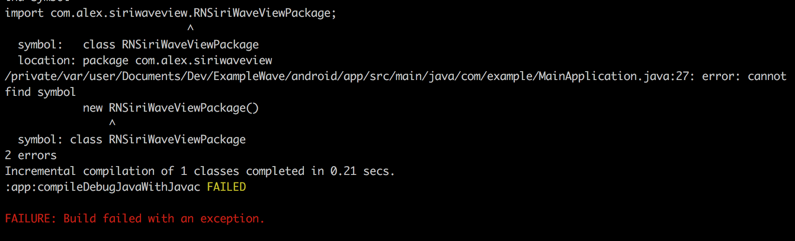

<h1 align="center">


<p align="center">
  <a href="https://www.npmjs.com/package/react-native-siri-wave-view"></a>
  <a href="https://github.com/prscX/react-native-siri-wave-view/pulls"></a>
  <a href="https://github.com/prscX/react-native-siri-wave-view#License"></a>
</p>

    ReactNative: Native Siri Wave View (Android/iOS): Deprecated

Due to time constraint, this library is deprecated and not maintained anymore, You can still use this library.

If this project has helped you out, please support us with a star 🌟
</h1>

This library is a React Native bridge around native libraries providing **Siri Wave** implementation

> **Note:** iOS 9 Wave Form is only supported on iOS.

| **[stefanceriu/SCSiriWaveformView](https://github.com/stefanceriu/SCSiriWaveformView) & [alexgomes09/SIRIWaveView](https://github.com/alexgomes09/SIRIWaveView)**             |
| ----------------- |
|                   |

| **[prscX/PXSiriWave9](https://github.com/prscX/PXSiriWave9)**             |
| ----------------- |
|                   |


## 📖 Getting started

- `$ npm install react-native-siri-wave-view --save`

- `$ react-native link react-native-siri-wave-view`

#### Android
- Please add `react-native-siri-wave-view` & `siriwaveview` module in your app by adding below snippet in your app settings.gradle. If it already exisit please ignore:

```javascript
include ':react-native-siri-wave-view'
project(':react-native-siri-wave-view').projectDir = new File(rootProject.projectDir, '../node_modules/react-native-siri-wave-view/android')

include ':siriwaveview'
project(':siriwaveview').projectDir = new File(rootProject.projectDir, '../node_modules/react-native-siri-wave-view/android/SIRIWaveView/siriwaveview')
```

- Add below `:react-native-siri-wave-view` & `:siriwaveview` in your app `build.gradle` depenencies:

```
dependencies {
    compile project(':siriwaveview')
    compile project(':react-native-siri-wave-view')
    compile fileTree(dir: "libs", include: ["*.jar"])
}

```

- Please add below snippet in your app build.gradle file

```
buildscript {
    repositories {
        jcenter()
        maven { url "https://maven.google.com" }
        ...
    }
}

allprojects {
    repositories {
        mavenLocal()
        jcenter()
        maven { url "https://maven.google.com" }
        ...
    }
}
```

- Please make sure your Android SDK > 27 and above

> **Note:** If you encounter [ISSUE - 2](https://github.com/prscX/react-native-siri-wave-view/issues/2), Please replace `import com.alex.siriwaveview.RNSiriWaveViewPackage;` with `import ui.siriwave.RNSiriWaveViewPackage;` in your app Android `MainApplication.java` class 



#### iOS

  - After `react-native link react-native-siri-wave-view`, please verify `node_modules/react-native-siri-wave-view/ios/` contains `Pods` folder. If does not exist please execute `pod install` command on `node_modules/react-native-siri-wave-view/ios/`, if any error => try `pod repo update` then `pod install`


## 💻 Usage

```javascript

import RNSiriWaveView from 'react-native-siri-wave-view';

<RNSiriWaveView type={0} width={400} height={200} startAnimation={this.state.startAnimation} stopAnimation={this.state.stopAnimation} />

```

## 💡 Props


- **Generic Props**

| Prop              | Type       | Default | Note                                                                                                       |
| ----------------- | ---------- | ------- | ---------------------------------------------------------------------------------------------------------- |
| `width`           | `number`     |    200     | Width of Siri Wave View |
| `height`       | `number`     |    100     | Height of Siri Wave View                        |
| `type`       | `number`     |    0     | Specify type of wave you need. Default: 0, SiriWave9: 1                        |
| `numberOfWaves`     | `number` |   5      | Number of waves you want in the view                                       |
| `backgroundColor` | `string` |    #FFFFFF     | Background Color of Siri Wave View           |  |
| `waveColor`    | `string`     |   #000000      | Color of Siri Waves                                        |  |
| `primaryWaveLineWidth`      | `string`     |   iOS: 3, Android: 50      | Width of primary wave
| `amplitude`      | `number`     |    0.5     | Amplitude of Waves |
| `frequency`      | `number`     |    1.5     | Frequency of Waves |
| `amplitude`      | `number`     |    0.01     | Amplitude of Waves |
| `startAnimation`      | `bool`     |    false     | To Start the wave animation |
| `stopAnimation`      | `bool`     |   false      | To Stop the ongoing wave animation |


- **iOS Props**

| Prop              | Type       | Default | Note                                                                                                       |
| ----------------- | ---------- | ------- | ---------------------------------------------------------------------------------------------------------- |
| `secondaryWaveLineWidth`      | `string`     |   1      | Width of secondary wave |
| `density`      | `number`     |     5    | Density of Waves |
| `phaseShift`      | `number`     |   -0.15      | Width of secondary wave |


- **Siri Wave 9 Props**

| Prop              | Type       | Default | Note                                                                                                       |
| ----------------- | ---------- | ------- | ---------------------------------------------------------------------------------------------------------- |
| `intensity`      | `number`     |    0.3     | Specify intensity of wave |
| `colors`      | `array`     |    ["#2085fc", "#5efca9", "#fd4767"]     | Specify colors of siri wave 9 colors |


## ✨ Credits

- iOS: [stefanceriu/SCSiriWaveformView](https://github.com/stefanceriu/SCSiriWaveformView)
- Android: [alexgomes09/SIRIWaveView](https://github.com/alexgomes09/SIRIWaveView)
- Siri Wave 9 Implementation by: [GreatPotter](https://github.com/GreatPotter)

## 🤔 How to contribute
Have an idea? Found a bug? Please raise to [ISSUES](https://github.com/prscX/react-native-bottom-action-sheet/issues).
Contributions are welcome and are greatly appreciated! Every little bit helps, and credit will always be given.

## 💫 Where is this library used?
If you are using this library in one of your projects, add it in this list below. ✨


## 📜 License
This library is provided under the Apache License.

RNSiriWaveView @ [prscX](https://github.com/prscX)

## 💖 Support my projects
I open-source almost everything I can, and I try to reply everyone needing help using these projects. Obviously, this takes time. You can integrate and use these projects in your applications for free! You can even change the source code and redistribute (even resell it).

However, if you get some profit from this or just want to encourage me to continue creating stuff, there are few ways you can do it:
* Starring and sharing the projects you like 🚀
* If you're feeling especially charitable, please follow [prscX](https://github.com/prscX) on GitHub.

  <a href="https://www.buymeacoffee.com/prscX" target="_blank"></a>

  Thanks! ❤️
  <br/>
  [prscX.github.io](https://prscx.github.io)
  <br/>
  </ Pranav >
